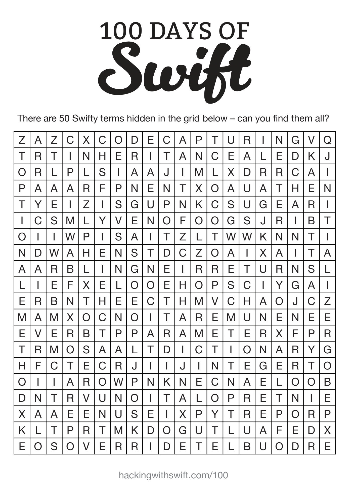

# 1. Swift 문법 복습

-   상수 및 변수 생성하는 방법
-   기본자료형(문자열, 정수, 소수, 부울)을 다루는 방법
-   집합자료형(배열, 딕셔너리, 세트)를 다루는 방법
-   열거형을 다루는 방법
-   조건문, 반복문, 삼항조건문
-   함수, 클로저
-   구조체, 클래스
-   프로토콜, extension
-   옵셔널

----------

### 50개의 스위프트 단어 퍼즐

----------

# 참고링크

-   Swift 용어 퍼즐 - [https://www.hackingwithswift.com/files/100/15-wordsearch.pdf](https://www.hackingwithswift.com/files/100/15-wordsearch.pdf)
-   Swift 용어집 - [https://www.hackingwithswift.com/glossary](https://www.hackingwithswift.com/glossary)
